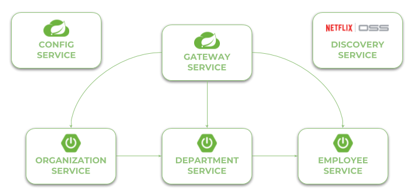

# Microservices with Spring Cloud Advanced Demo Project 

In this project I'm demonstrating you the most interesting features of [Spring Cloud Project](https://spring.io/projects/spring-cloud) for building microservice-based architecture.

### Usage

In the most cases you need to have Maven and JDK8+. In the fourth example with OpenShift you will have to run **Minishift** on your machine. The best way to run the sample applications is with IDEs like IntelliJ IDEA or Eclipse.  

## Architecture

Our sample microservices-based system consists of the following modules:
- **gateway-service** - a module that Spring Cloud Gateway for running Spring Boot application that acts as a proxy/gateway in our architecture.
- **config-service** - a module that uses Spring Cloud Config Server for running configuration server in the `native` mode. The configuration files are placed on the classpath.
- **discovery-service** - a module that depending on the example it uses Spring Cloud Netflix Eureka.
- **employee-service** - a module containing the first of our sample microservices that allows to perform CRUD operation on in-memory repository of employees
- **department-service** - a module containing the second of our sample microservices that allows to perform CRUD operation on in-memory repository of departments. It communicates with employee-service. 
- **organization-service** - a module containing the third of our sample microservices that allows to perform CRUD operation on in-memory repository of organizations. It communicates with both employee-service and organization-service.

The following picture illustrates the architecture described above.

 

